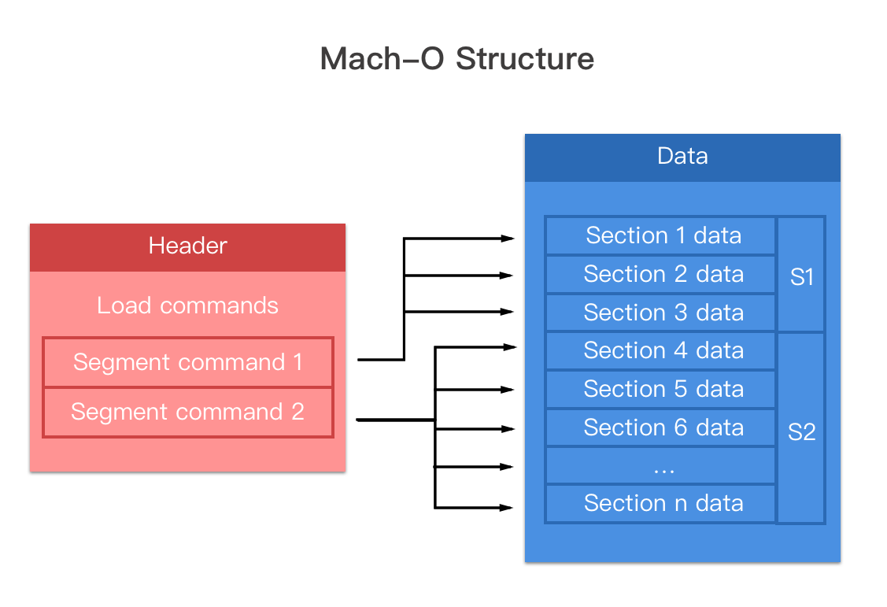

## Mach-O文件

当我们使用 `Xcode` 构建一个程序，会将所有的 `.m` 文件转换为一个可执行文件，这个可执行文件最终将会被 `cpu` 执行

在`iOS`中，每一个应用都是一个进程，而进程则是程序运行的实例。

`Mach-O` 作为 `macOS` 系统中的可执行文件，可以被系统执行。


* mach-o 结构图

主要由三部分组成:

* Mach-O 头（Mach Header）：这里描述了 Mach-O 的 CPU 架构、文件类型以及加载命令等信息；

* 加载命令（Load Command）：描述了文件中数据的具体组织结构，不同的数据类型使用不同的加载命令表示；

* 数据区（Data）：Data 中每一个段（Segment）的数据都保存在此，段的概念和 ELF 文件中段的概念类似，都拥有一个或多个 Section ，用来存放数据和代码

其中 Mach-O 头 与加载命令不关心，我们来看一下 数据区的内容，数据区由 Segment 段和 Section 节组成。

```
#define    SEG_PAGEZERO    "__PAGEZERO" /* 当时 MH_EXECUTE 文件时，捕获到空指针 */
#define    SEG_TEXT    "__TEXT" /* 代码/只读数据段 */
#define    SEG_DATA    "__DATA" /* 数据段 */
#define    SEG_OBJC    "__OBJC" /* Objective-C runtime 段 */
#define    SEG_LINKEDIT    "__LINKEDIT" /* 包含需要被动态链接器使用的符号和其他表，包括符号表、字符串表等 */

```
* Segment段


## __链接__

* [Mach-O 可执行文件](https://objccn.io/issue-6-3/)

* [探秘 Mach-O 文件](https://juejin.im/post/5ab47ca1518825611a406a39)

* [Mach-O 文件格式探索](https://www.desgard.com/iOS-Source-Probe/C/mach-o/Mach-O%20%E6%96%87%E4%BB%B6%E6%A0%BC%E5%BC%8F%E6%8E%A2%E7%B4%A2.html)